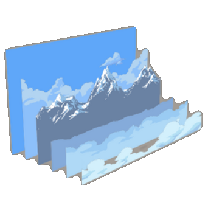

# JKS Tools2D - Parallax Editor

[](https://github.com/JavaKhanStudio/JKS_Tools2D_ParallaxEditor/actions/workflows/ci.yml)
[](LICENSE)

A desktop editor to build parallax backgrounds visually, for the
[JKS Tools2D - Parallax Background](https://github.com/JavaKhanStudio/JKS_Tools2D_ParallaxBackground) library.

You compose a parallax from an atlas and/or PNG images, tune each layer while it scrolls, then export a `.plax` (or
`.jplax`) file. A game loads that file with the library (`io.github.javakhanstudio:parallax-background` on Maven
Central, or its Godot and jMonkeyEngine readers), which scrolls, tiles and draws the layers behind the game. The file
formats, and how to use a page in a game, are in [the library's README](https://github.com/JavaKhanStudio/JKS_Tools2D_ParallaxBackground#readme).

The editor and the demo lived in the library's repository until 2026, and came here with their history.

## Get it

Download `ParallaxEditor-<version>.zip` from the [latest release](https://github.com/JavaKhanStudio/JKS_Tools2D_ParallaxEditor/releases/latest), unzip it and run
`bin/ParallaxEditor` (`bin\ParallaxEditor.bat` on Windows). It includes the library and the sample projects, and
needs Java 17 or newer. Releases up to 2.4.0 are on [the library's release page](https://github.com/JavaKhanStudio/JKS_Tools2D_ParallaxBackground/releases).

## Build and run

| Module   | What it is                                                                                  |
|----------|---------------------------------------------------------------------------------------------|
| `editor` | The Parallax Editor (desktop, LWJGL3 + VisUI).                                               |
| `demo`   | A small game using the library: the showcase pages, cross-faded and tinted on demand; the grading lab; the stress test. |

Requirements: JDK 17 or newer. The Gradle wrapper downloads Gradle itself.

```bash
./gradlew :editor:run           # the editor, opens on the sample projects in editor/Files
./gradlew :demo:run             # the demo: the showcase pages; SPACE variant, ENTER next scene, N tints, LEFT/RIGHT scroll, R resets
./gradlew :demo:run --args="--page /path/to/page.jplax"   # one exported page instead, its atlas beside it; prints its SEQUENCE layers' cycles
./gradlew :demo:stress --args="--layers 400 --repeat xy"   # frame time of generated pages, see ParallaxStress
./gradlew :demo:lab             # grade parallax scenes blind, 1-5
./gradlew :editor:installDist   # standalone editor in editor/build/install/ParallaxEditor
```

Versions (libGDX, VisUI, Jackson, the library) are set in `gradle.properties`.

### The library: from Maven Central, or from a checkout beside this one

The editor writes pages with the library's own code, so it depends on it like any game:
`io.github.javakhanstudio:parallax-background:$parallaxVersion`. On `develop` that is the library's `-SNAPSHOT`, which
every push to the library's `develop` publishes.

To change the library and see it in the editor at once, clone it next to this repository:

```
parent/
    JKS_Tools2D_ParallaxBackground/     the library
    JKS_Tools2D_ParallaxEditor/         this repository
```

`settings.gradle` then includes that checkout's build and builds `core` from source in place of the Maven artifact:
a change to it shows in `./gradlew :editor:run` with nothing published. `./gradlew :editor:parallaxSource` says which
one the build took, and `-PparallaxFromCentral` takes the Maven artifact even with the checkout there.
`tools/sibling-core-check.sh` proves both ways.

## Using the editor

### Start screen

Open a project (`.plaxpj`), an exported parallax (`.plax` or `.jplax`), or an atlas (`.atlas`) to start a project
from it. **NEW** starts an empty project. Files can also be dragged onto the window.

### Edition screen

- **Center:** the live preview. Use play/pause, full screen, the X/Y speed sliders and "Reset position".
  Arrows/WASD (and space) scroll it by hand.
- **Top:** project folder and name. The two save buttons are **Save project** (`.plaxpj`) and **Export** (`.plax` and/or
  `.jplax`, see the format checkboxes). **ETC2** and **Pixel art**, with them, are saved with the project: see "Loose
  images and export".
- **Left tabs:**
  - **Controls:** help and tutorial links; **Parallax** (repeat on X/Y, current atlas, copy loose images next to the
    project, back to the start screen); **Application** (window size, full screen, VSync).
  - **Add texture:** **Adding new** is the list of images. The selected image has three buttons: *add it as a layer*,
    *make the layers of this image use another one*, and *delete it*. **Default Value** sets the settings of the
    next added layer, and how they change after each addition (speeds are multiplied, the rest is added), which
    quickly builds a stack of layers with depth.
  - **Textures:** every setting of the selected layer: its position in the stack, clone, set as default, delete/undo,
    flips, and the sliders. The arrow buttons next to a slider copy that value from the layer in front / behind.
    **Kind** makes the layer an `IMAGE`, an `EMPTY` slot a game's hook draws (its **Name** is the hook's key), a
    `PARTICLES` effect (a libGDX `.p` and a Godot `.tscn`, named relative to the atlas's folder, typed or picked with
    `...`; the libGDX one plays in the preview; **Anchor** `LAYER` or `VIEW`), a `SHADER` drawing its image through
    `WAVE` or `FOG` (**Amplitude**, **Wavelength**, **Speed**), or a `SEQUENCE` chaining several images. A layer made
    `SEQUENCE` starts with its image as its one segment and a new seed. Its **Segments** are listed A, B, C... with a
    weight each (how often it is picked, out of the sum), `^` `v` to move one, `x` to remove one (not the last);
    **Add the image selected in Adding new** appends a segment, an atlas region or a loose image (export flattens it
    into the atlas like any other). The first segment sets the layer's height, so moving another first rescales the
    layer. **Seed** is typed or drawn anew with **Re-roll**; **Cycle length** is how many segments the cycle holds
    before it repeats, and "repeats every X screens" how wide that cycle is, in screen widths, as the layer scrolls by.
    The **Cycle** line spells it slot by slot, as the preview draws it: from the page's seed, which is what a game
    draws when it passes none of its own. Under it, one mark per engine (libGDX, browser,
    Godot, jME): green it draws the layer, orange it lacks a file or name, red it cannot (jME draws no particles);
    hover a mark for why. A control only some engines read says which. Making an `EMPTY` or `PARTICLES` layer an
    image again gives it back its image, or the one selected in **Adding new**; a `SEQUENCE` made another kind keeps
    its first segment. Saving the project elsewhere copies the
    effect files with the atlas. What each setting means: the library README's layer settings.
  - **Background:** the top and bottom squares: on/off, size, and both colors, with an eyedropper that picks a color
    from the preview (right click cancels it).

The mouse wheel changes the slider under the mouse. Over a slider's number field, it changes the digit left of the
text cursor.

### Loose images and export

Drop PNG files on the edition screen to add them without an atlas. They reload automatically when you save them from
an image editor. When you export a project that uses loose images (or with **F.Export** checked), the editor first
**flattens** it: every image of the list is packed into a new atlas next to the project (`<name>.atlas` plus
`<name>_1.png`, `<name>_2.png`...), and the project then uses that atlas. Each page is written only as large as the
images it holds, rounded up to a power of two: a few small images make a 512 px page, not a 4096 px one. The page
shape (4096x4096, 4096x2048...) is the one that writes the fewest pixels.

The atlas is written `filter: MipMapLinearLinear,Linear`, which softens pixel art (City differs from its preview by up
to 33/255 per channel). Tick **Pixel art** and it is written `filter: Nearest,Nearest`, without mipmaps, its pages no
longer rounded to a power of two. The preview switches to Nearest as soon as the box is ticked, and back when it is
unticked, so you see the difference before exporting. Export flattens a pixel-art project whose atlas is not already
`Nearest,Nearest`. The game reads the filter from the atlas, the Godot reader too.

Tick **ETC2** and the flattened atlas is also written as `<name>.etc2.atlas`, whose pages are ETC2 RGBA8
(`GL_COMPRESSED_RGBA8_ETC2_EAC`) with their mip chain, in gzipped KTX files (`<name>_1.zktx`...): see the library's README, "Using the library in a game", for loading
it. Export flattens a project with ETC2 ticked whose atlas has no ETC2 copy yet.

The project is auto-saved every 5 minutes into `Files/AutoSave` (or `~/.parallax-editor/autosave` when the editor is
not started from its module folder). The 10 most recent auto-saves are kept.

### Driving the editor from another program

`--driver-port=N` lets a script drive the editor, for demos and narrated videos. It is off unless you pass the flag,
and it listens on `127.0.0.1` only:

```bash
./gradlew :editor:run --args="--driver-port=47777 Files/Demos/OneNight.plaxpj"
echo "click tab.textures" | nc 127.0.0.1 47777
```

It reads one command per line and answers each one with `ok ...` or `err ...`. `list` gives the named controls on screen
with their bounds, `bounds`, `click`, `set` and `wheel` act on one control, `open` loads a file, and `shot` writes the next
frame to a PNG. `resize W H` sets the window size, where the window manager lets it. `fps` gives the frame rate and render-thread time over the last 120 frames. A control is found by its name (`texture.sizeRatio`, `tab.background.topSquare`), or by its text with
`text:Yes`. The full list is in `EditorDriver`'s javadoc. A resize rebuilds the panels and puts every tab back on its
first, so commands wait for that rebuild. Set the window size before the demo, not during it. `tools/driver-probe.sh`
starts the editor off screen, sends it the commands it reads, and stops it. Its headless display is 1280x720 and
refuses `resize`; with `PROBE_SIZE=WxH` the editor runs in a nested X server of that size, where `resize` works.

To profile the editor on a heavy page, `tools/stress-project.py 300` writes a 300-layer project in
`editor/build/stress`, and `tools/editor-stress.txt` is a session of edits, save and export to replay on it:

```bash
(echo "open build/stress/Stress300.plaxpj"; cat tools/editor-stress.txt) | PROBE_TIMES=1 tools/driver-probe.sh
```

## Code map

```
editor/mains/.../Launcher_Editor  desktop launcher (window, file drops)
editor/src/jks/tools2d/
    amains/Main_Editor            application: switches between the two screens
    parallax/editor/vue/          Vue_Selection (start screen), Vue_Edition (edition screen)
    parallax/editor/vue/edition/  the panels (VE_*), project data, save/export/flatten utilities, atlas packer
    parallax/editor/gvars/        editor-wide state, paths, UI skin and fonts, JSON setup
    parallax/editor/driver/       EditorDriver (--driver-port), Names (the controls' names)
    filechooser/ filewatch/ libgdxutils/   file browser, file watcher, small scene2d widgets
editor/Files/                     the sample projects (Demos/ goes in the zip)

demo/src/.../ParallaxDemo         example game
demo/src/.../ParallaxLab          the grading lab: the rounds of demo/lab shown blind and graded
demo/src/.../ParallaxStress       generated pages, timed without vsync
demo/showcase/                    the showcase pages the demo plays
```

The editor keeps its state in static `GVars_*` classes, one project at a time. The panels read the window size when
they are built, so the edition screen rebuilds them after a resize.

## Contributing and releases

Work happens on `develop`, releases are tagged on `master`, and CI builds every push and pull request on JDK 17, 21
and 25. [RELEASING.md](RELEASING.md) describes the branches and how to cut a release.

## License

Apache License 2.0, see [LICENSE](LICENSE).

## Credits

The library the editor builds on started in 2017 as a fork of
[ParallaxBackground-libgdx](https://github.com/fooble/ParallaxBackground-libgdx) by **Rahul Verma**, Copyright 2014,
licensed under the Apache License 2.0. See [NOTICE](NOTICE) for the other third-party code included in the editor.
